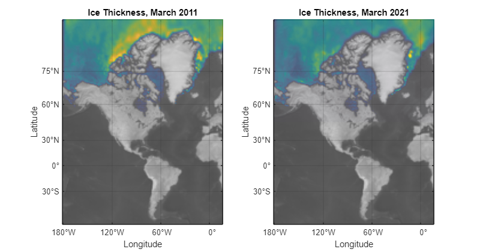

# Climate Data Store Toolbox for MATLAB

[](https://www.mathworks.com/matlabcentral/fileexchange/climatedatastore)

MATLAB&reg; Tools to access [The Climate Data Store](https://cds.climate.copernicus.eu/).  It is a wealth of information about the Earth's past, present and future climate. There are hundreds of data sets associated with climate change. This toolbox allows you to easily access data and download it for analysis in MATLAB.

## Functions

| Function | Description |
| ------ | ------ |
|  `climateDataStoreDownload` | Get data from Copernicus Climate Data Store |

## Usage

   1. See the notes below for information on first time install
   2. type `help climateDataStoreDownload` for help on using the function
   3. Find your dataset at [Climate Data Store](https://cds.climate.copernicus.eu/#!/home) and click on the "download data" tab.  Make your selections for the subset of data you want.  Click "show API request" at the bottom.
   4. Use `climateDataStoreDownload` to get the data.  The first parameter is the name of the data set to retrieve, and will be used as the name of the directory to put the downloaded files in.  The second parameter is a MATLAB version of the python structure that selects what subset of the data to download. `climateDataStoreDownload` downloads the files, and returns a list of files that were downloaded.  Typically, these are NetCDF files with an .nu extension, which are read using the [ncinfo](https://www.mathworks.com/help/matlab/ref/ncinfo.html) and [ncread](https://www.mathworks.com/help/matlab/ref/ncread.html) functions.  Note that downloading the files can take some time, depending on how large they are.

## First time Install

* Requires MATLAB release R2019a or newer
* Install the toolbox by doubleclicking on the `climatedatastore.mltbx` file.
* This relies on the [CDS Python API](https://github.com/ecmwf/cdsapi) created by the European Centre for Medium-Range Weather Forecasts (ECMWF). You'll need to have python installed.  Get it from the [Python Download page](https://www.python.org/downloads/). See [this MATLAB documentation](https://www.mathworks.com/help/matlab/matlab_external/install-supported-python-implementation.html) for more information.
* The toolbox will automatically configure python and download and install the CSAPI package (you can manually install using `pip3 install cdsapi`)
* The toolbox will prompt you the first time for CSAPI credentials.  Visit [How to use the CDS API](https://cds.climate.copernicus.eu/api-how-to) for more info.

## MATLAB Features Used

This demonstrates a number of MATLAB features, including:

* [Calling Python From MATLAB](https://www.mathworks.com/help/matlab/call-python-libraries.html)
* [Toolbox Packaging](https://www.mathworks.com/help/matlab/matlab_prog/create-and-share-custom-matlab-toolboxes.html)
* [MATLAB Projects](https://www.mathworks.com/help/matlab/projects.html)
* [Argument validation](https://www.mathworks.com/help/matlab/matlab_prog/function-argument-validation-1.html)

## Example: Getting Started with Copernicus Climate Data Store Toolbox

[The sea ice thickness dataset](https://cds.climate.copernicus.eu/cdsapp#!/dataset/satellite-sea-ice-thickness) provides monthly gridded data of sea ice thickness for the Arctic region based on satellite radar altimetry observations. Sea ice is an important component of our climate system and a sensitive indicator of climate change. Its presence or its retreat has a strong impact on air-sea interactions, the Earth’s energy budget as well as marine ecosystems. It is recognized by the Global Climate Observing System as an Essential Climate Variable. Sea ice thickness is one of the parameters commonly used to characterize sea ice, alongside sea ice concentration, sea ice edge, and sea ice type, also available in the Climate Data Store.

Select the sea ice thickness dataset.

```matlab:Code
datasetName ="satellite-sea-ice-thickness";
```

Select the data to download from the dataset (see [this webpage](https://cds.climate.copernicus.eu/cdsapp#!/dataset/satellite-sea-ice-thickness?tab=form) for options). This is a "MATLABized" version of the python structure that is generated in the API request.

```matlab:Code
options.version = "1_0";
options.variable = "all";
options.satellite = "cryosat_2";
options.cdr_type = ["cdr","icdr"]; 
options.year = ["2011","2021"]; 
options.month = "03";
```

Download the data from Climate Data Store using **`climateDataStoreDownload`**. It is put in a directory called "satellite-sea-ice-thickness."

```matlab:Code
downloadedFilePaths = climateDataStoreDownload('satellite-sea-ice-thickness',options);
```

```text:Output
2021-11-10 10:38:13,694 INFO Welcome to the CDS
2021-11-10 10:38:13,697 INFO Sending request to https://cds.climate.copernicus.eu/api/v2/resources/satellite-sea-ice-thickness
2021-11-10 10:38:13,830 INFO Request is completed
2021-11-10 10:38:13,832 INFO Downloading https://download-0003.copernicus-climate.eu/cache-compute-0003/cache/data7/dataset-satellite-sea-ice-thickness-639d640c-3099-42c0-8878-6c335586d2c7.zip to C:\Users\rpurser\AppData\Local\Temp\tp3e8d85e3_9026_4531_ad2b_f3199a006857.zip (4.4M)
2021-11-10 10:38:15,378 INFO Download rate 2.8M/s
```

### Read and format ice thickness data from 2011 and 2021

Transform and load the latitude, longitude, and ice thickness.

```matlab:Code
ice2011 = readSatelliteSeaIceThickness("satellite-sea-ice-thickness\ice_thickness_nh_ease2-250_cdr-v1p0_201103.nc");
ice2021 = readSatelliteSeaIceThickness("satellite-sea-ice-thickness\ice_thickness_nh_ease2-250_icdr-v1p0_202103.nc");
head(ice2021)
```

| |time|lat|lon|thickness|
|:--:|:--:|:--:|:--:|:--:|
|1|01-Mar-2021|47.6290|144.0296|2.4566|
|2|01-Mar-2021|47.9655|144.0990|2.5800|
|3|01-Mar-2021|50.5072|148.0122|-0.0364|
|4|01-Mar-2021|50.8360|148.1187|1.0242|
|5|01-Mar-2021|50.3237|146.9969|0.0518|
|6|01-Mar-2021|51.1642|148.2269|0.2445|
|7|01-Mar-2021|50.9112|147.6573|0.8933|
|8|01-Mar-2021|50.6540|147.0948|0.1271|

_Generated using Copernicus Climate Change Service information 2021_

### Visually compare March ice thickness in 2011 and 2021

```matlab:Code
subplot(1,2,1)
geodensityplot(ice2011.lat,ice2011.lon,ice2011.thickness,"FaceColor","interp")
geolimits([23 85],[-181.4 16.4])
geobasemap("grayterrain")
title("Ice Thickness, March 2011")

subplot(1,2,2)
geodensityplot(ice2021.lat,ice2021.lon,ice2021.thickness,"FaceColor","interp")
geolimits([23 85],[-181.4 16.4])
geobasemap("grayterrain")
title("Ice Thickness, March 2021")
f = gcf;
f.Position(3) = f.Position(3)*2;
```



_Generated using Copernicus Climate Change Service information 2021_

## License

The license is available in the License file within this repository

_Note that each data set in the Copernicus Climate Data Store has its own license terms.  You should review the license terms for the data set that you are planning to use to ensure that it can be used in the way that you have planned._

&copy; 2021, The MathWorks, Inc.
